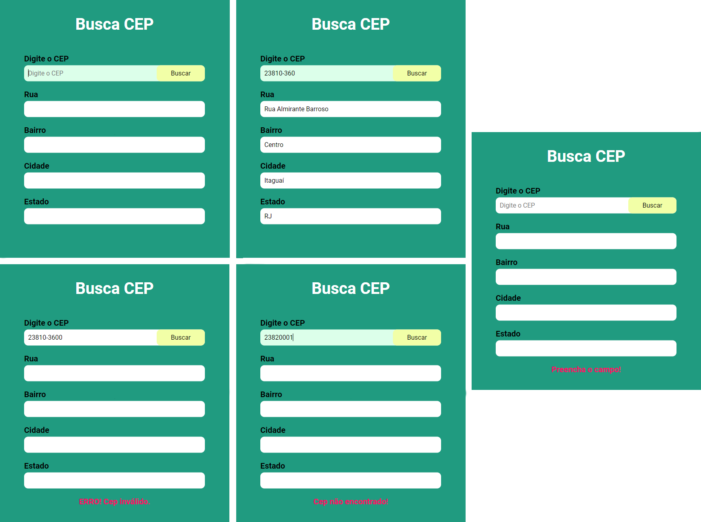

# Busca CEP - Localizar endereços através do CEP

Projeto criado com Javascript puro, que faz uma requisição para a API da <a href="https://viacep.com.br/">Via CEP</a> e retorna o endereço do CEP solicitado, caso ele exista.
- Se o usuário não informar um CEP e tentar buscar, aparecerá uma mensagem pedindo para que preencha o campo. 
- Se o CEP informado não for encontrado ou o formato do CEP estiver fora do padrão, a aplicação informa ao usuário.

 
<a href="https://iammatheus.github.io/busca-cep">Visualizar projeto<a/>
 
### Desenvolvimento
 - HTML
 - CSS
 - Javascript
